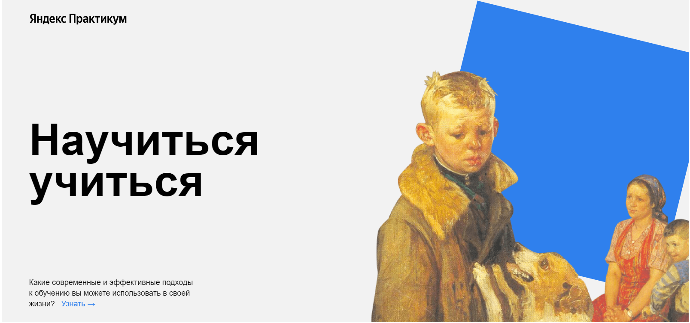

<h1 align="center">"Научиться учиться"</h1>
<h3 align="center">Первая проектная работа</h3>

## Описание проекта

Учебный проект от [Я.Практикум](https://practicum.yandex.ru/web/) представляет собой веб-страницу, созданную с целью помочь вам освоить эффективные подходы к обучению и улучшить свои навыки самообучения.
Веб-страница создана на основе двух брифов: [Бриф №1](https://code.s3.yandex.net/web-developer/project-1/sprint-1-brief.pdf) и
[Бриф №2](https://code.s3.yandex.net/web-developer/project-1/sprint-2-brief.pdf) на HTML и CSS и содержит информацию о различных методах и техниках обучения.

## Используемые технологии

HTML5 | CSS3 | БЭМ / файловая структура в соответствии с Nested БЭМ | FlexBox | API Youtube | Iframe и @keyframes | Animation | Transformation

## [Ссылка на сайт](https://elislis7.github.io/how-to-learn/)

<h4 align="center">План по доработке проекта</h4>

 - Оформить форму для взаимоденйствия с пользователями сайта | ✅
 - Функциональность всех ссылок (сейчас закрыты заглушками) |
 - Адаптивность сайта |
 - Доработка функционала сайта посредством JavaScript |